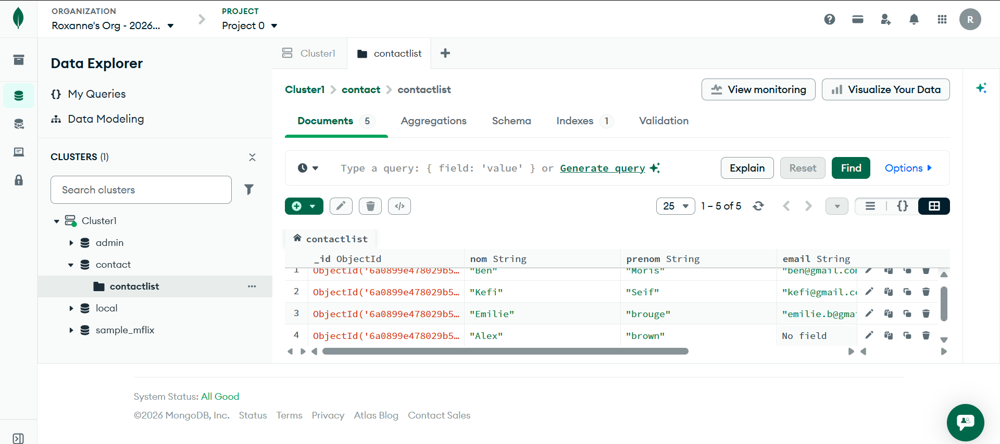

 Checkpoint MongoDB CRUD

 Base de données : contact
 Collection : contactlist

 1. Insertion des documents

2. Afficher tous les contacts

 3. Recherche par ID

 4. Contacts âge > 18

5. Âge > 18 ET nom contient "ah"

6. Mise à jour Kefi Seif → Anis

7. Suppression âge < 5

 8. Liste finale
